# ESG DataOps Command Center

Operational dashboard for ESG batch pipeline monitoring, data quality checks, incident response, and daily reporting.

## Overview

This project is a full-stack Next.js application for monitoring ESG data ingestion, validation, reconciliation, and operational triage. It is designed to help teams track file arrivals, assess data quality, investigate exceptions, and produce daily operational summaries for a sustainability reporting workflow.

## Screenshots

A quick visual tour of the control room and core operational views:

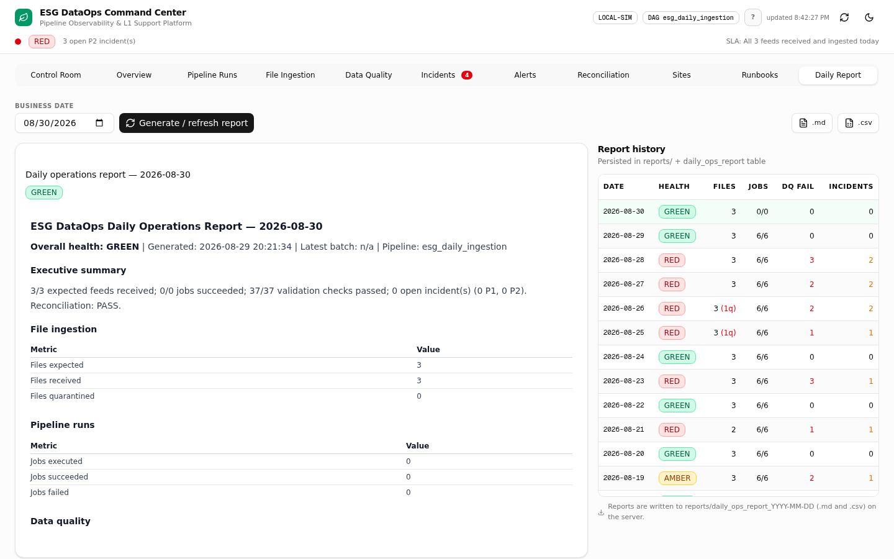

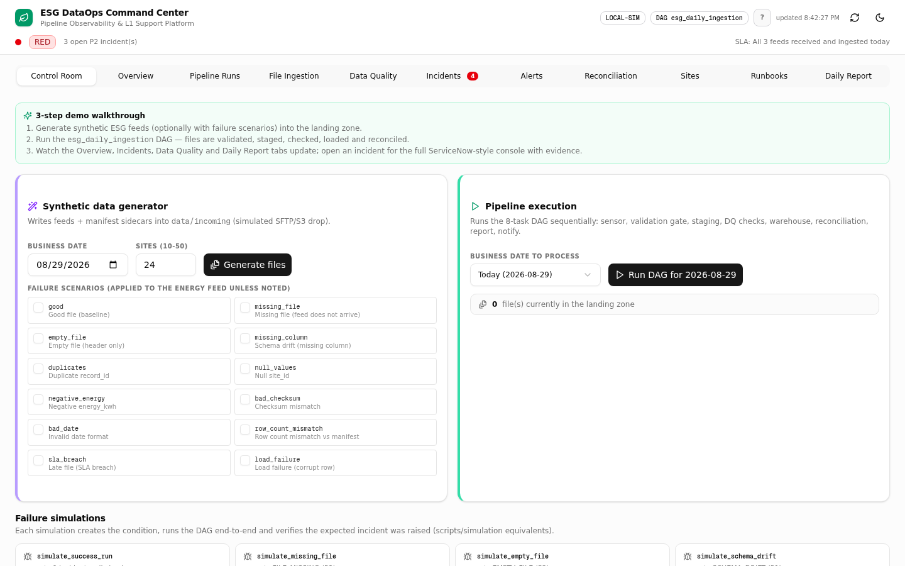

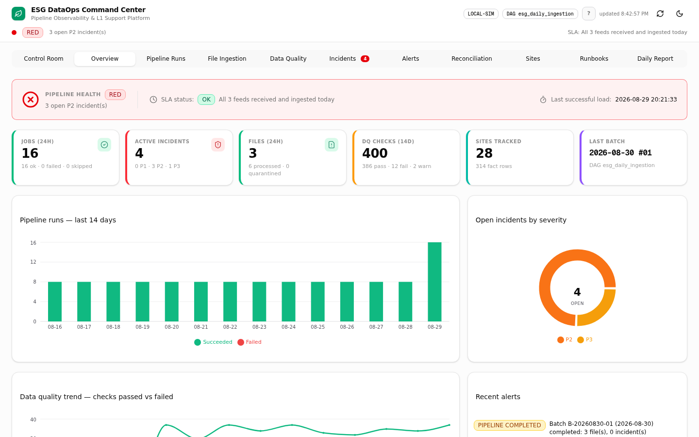

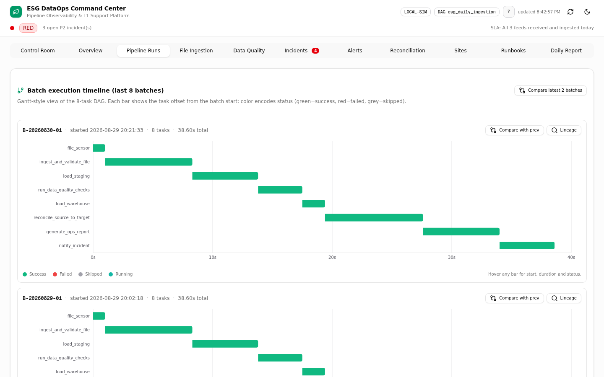

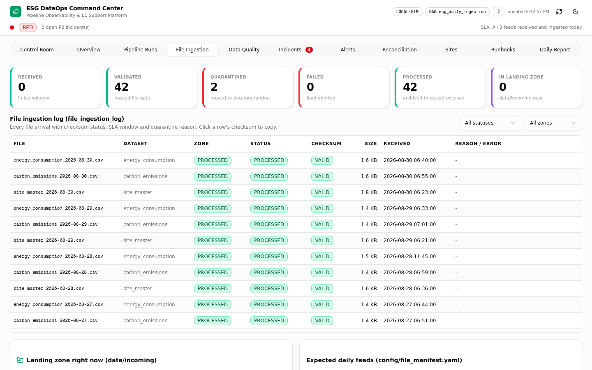

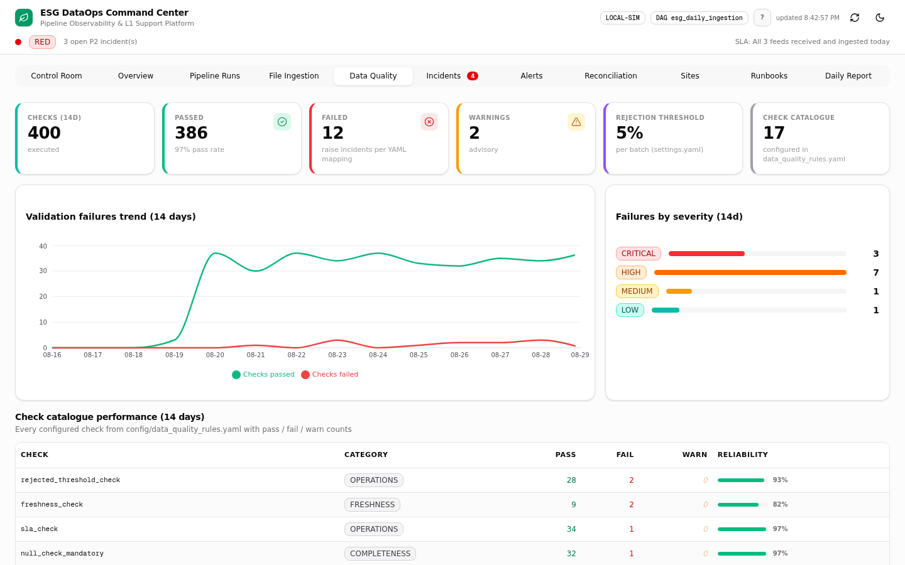

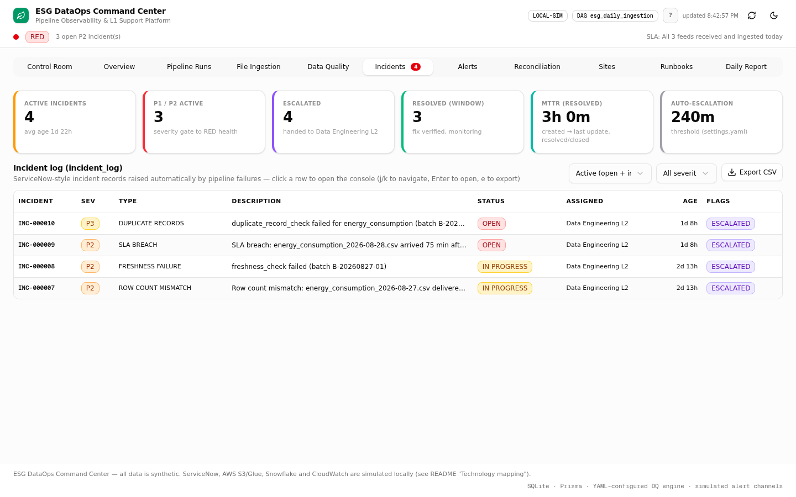

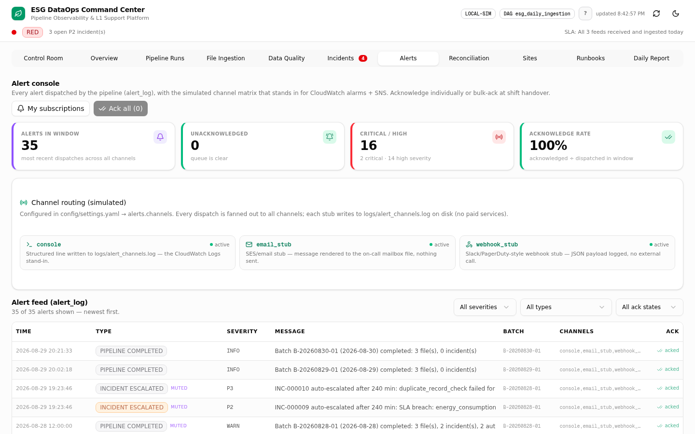

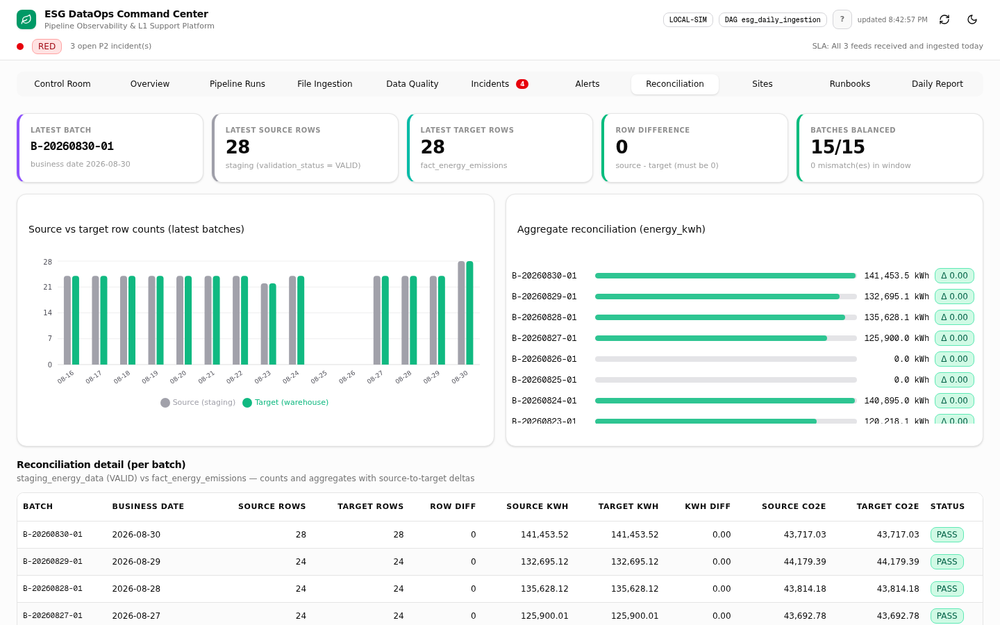

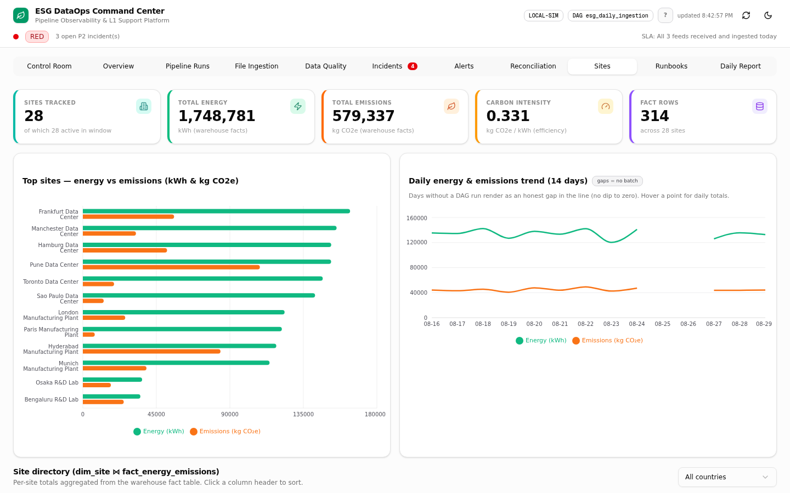

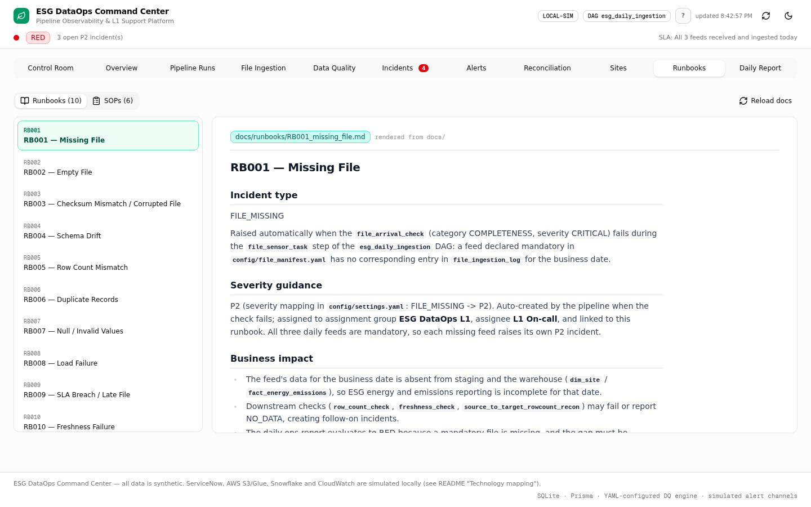


## Core capabilities

- File arrival monitoring and manifest validation
- Staging and warehouse loading logic with reconciliation checks
- Data-quality rule execution and issue tracking
- Incident lifecycle management and evidence capture
- Alerting, runbooks, and daily ops reporting
- Local dashboard for operational triage and handoff review

## Architecture

```text
Source feeds -> landing zone -> validation -> staging -> warehouse -> reconciliation
                          |                     |                |
                          v                     v                v
                    incidents           alerting          daily reporting
```

The app includes:

- API routes for state, datagen, pipeline runs, incidents, alerts, and runbooks
- Prisma + SQLite-backed operational schema
- YAML-controlled quality checks
- Next.js dashboard with operational tabs for monitoring and triage

## Tech stack

- Next.js 16
- TypeScript
- Tailwind CSS
- Prisma ORM
- SQLite for local operational storage
- YAML configuration for quality rules and operational settings

## Local setup

Prerequisites: Node.js 18+ and npm.

```bash
npm install
cp .env.example .env
npm run db:push
npm run dev
```

Open http://localhost:3000

## Useful commands

```bash
npm run dev
npm run build
npm run lint
npm run db:push
```

## Project structure

```text
src/                # App routes and UI components
config/             # YAML configuration
prisma/             # Database schema
data/               # Incoming, processed, quarantine, and local demo data
logs/               # App and alert logs
reports/            # Daily reporting output
docs/               # SOP and runbook docs
public/             # Static assets
```

## Notes

- The app is designed to run locally without external cloud dependencies.
- The database is local and intended for demo and portfolio use.
- The app is structured so the operational model can be mapped to Postgres/Snowflake or other warehouse patterns with minimal changes.

## License

This project is for portfolio and demonstration use.

- **Dashboard:** Control Room → *Pipeline execution* → **Run DAG** for the selected business date.
- **API:** `curl -X POST http://localhost:3000/api/pipeline/run -H "Content-Type: application/json" -d '{"businessDate":"2026-08-20"}'` (date optional; defaults to today).

The `esg_daily_ingestion` DAG executes 8 tasks in order (retries=1 each; downstream critical tasks are SKIPPED on failure; report/notify run regardless via all_done semantics):

| # | Task | What it does |
|---|------|--------------|
| 1 | `file_sensor_task` | Detects files in `data/incoming`, checks arrival against `config/file_manifest.yaml` (expected 06:15/06:30/06:40, SLA 2h/4h), raises FILE_MISSING / SLA_BREACH |
| 2 | `ingest_and_validate_file_task` | File-level gate: SHA256 checksum vs manifest sidecar, header/schema validation, row count vs `expected_rows`; failures quarantine the file with reason |
| 3 | `load_staging_task` | Bulk loads validated files into staging tables with row-level validation (rejects bad rows; load policy `validated_records_only`) |
| 4 | `run_data_quality_checks_task` | Executes the 17 YAML-configured DQ checks; failures with `create_incident: true` raise incidents automatically |
| 5 | `load_warehouse_task` | Transforms staging into the star schema (`dim_site`, `fact_energy_emissions`) |
| 6 | `reconcile_source_to_target_task` | Row-count and aggregate reconciliation (tolerance 0.01 kWh) between staging and fact, plus freshness |
| 7 | `generate_ops_report_task` | Writes `reports/daily_ops_report_YYYY-MM-DD.md` + `.csv` (all_done — runs even after failures) |
| 8 | `notify_incident_task` | Dispatches alerts across channels, runs the 240-minute escalation sweep, logs the batch summary (all_done) |

Every task run is recorded in `job_run_audit` with status RUNNING → SUCCESS / FAILED / SKIPPED, duration and row counts. `batch_id` format: `B-YYYYMMDD-NN`.

**Daily ops report** (written by task 7): `reports/daily_ops_report_YYYY-MM-DD.md` + `.csv` with fields `report_date`, `files_expected`, `files_received`, `files_quarantined`, `jobs_executed`, `jobs_succeeded`, `jobs_failed`, `dq_checks_executed`, `dq_checks_passed`, `dq_checks_failed`, `open_incidents`, `p1_incidents`, `p2_incidents`, `reconciliation_status`, `overall_health`. Health logic: **GREEN** = no failed jobs, no P1/P2 incidents, reconciliation pass; **AMBER** = warnings, non-critical validation failures, or one P3 incident; **RED** = failed load, P1/P2 incident, missing mandatory file, or reconciliation failure.

## 11. Running the Local Orchestrator

**The API is the local orchestrator.** `src/lib/esg/engine.ts` runs the same task functions sequentially that an Airflow DAG would call — the task functions, retry policy, failure callbacks, XCom-style context (`batch_id`/`run_id`) and audit trail are all production-shaped; only the scheduler is replaced by an HTTP trigger. This is the deliberate fallback design: pointing a real Airflow deployment at the same task functions is a wiring change, not a rewrite.

```bash
# Trigger a run (equivalent of `airflow dags trigger esg_daily_ingestion`)
curl -X POST http://localhost:3000/api/pipeline/run \
  -H "Content-Type: application/json" -d '{"businessDate":"2026-08-20"}'

# Inspect task-level audit + current state
curl http://localhost:3000/api/state
```

The response contains per-task status, incidents created, file counts (received/validated/quarantined), load stats, DQ stats and the report's overall health.

## 12. Running the Dashboard

The dashboard **is the app** — open `/`. Eleven tabs:

| Tab | What to look at |
|---|---|
| **Control Room** | Generate synthetic data, run the DAG, fire failure simulations; one-stop demo driver |
| **Overview** | GREEN/AMBER/RED health, KPI tiles (files, jobs, checks, incidents), 14-day trends, and a **Generate shift handover** action that prepares a structured markdown handover document for the incoming on-call shift (downloadable as `shift_handover_YYYY-MM-DD.md`) |
| **Pipeline Runs** | `job_run_audit` per task: status, duration, rows read/loaded/rejected, error messages — plus the **DAG dependency graph** (Airflow-style node/edge diagram of the 8-task DAG: the 6-task critical chain solid, the two `trigger_rule=all_done` leaf tasks dashed violet; node colour = per-batch task status, click a node to filter the runs table), a Gantt-style batch timeline, per-batch **Replay** (regenerates clean feeds for that business date and re-runs the DAG as a new append-only batch — the L1 "root cause fixed, reload the feed" runbook step), and the **Batch Explorer** (click *Lineage* on any batch for end-to-end traceability: a **per-batch DAG dependency graph** of that batch's task statuses, then tasks → files → staging → DQ checks → incidents/evidence → reconciliation → warehouse impact) |
| **File Ingestion** | Landing-zone view per file: zone (INCOMING/QUARANTINE/PROCESSED), checksum status, file status lifecycle |
| **Data Quality** | All 17 checks per batch: status PASS/FAIL/WARN, expected vs actual values, severity — **click any check row to open the rule + history drawer** (what the check validates, rule config, a **rolling 5-run pass-rate mini-chart** (SVG trend line with an 80% reference line and red fail ticks — degrading checks dip visibly), an execution status ribbon — one coloured bar per execution, oldest → newest — up to 50 recent executions with a show-all toggle, and the runbook deep-link) |
| **Incidents** | Incident queue (severity-coloured row edges) with lifecycle management (OPEN → IN_PROGRESS → RESOLVED → CLOSED), work notes, evidence viewer, support summary tooling, MTTA/MTTR response metrics, **escalation-SLA countdown chips** ("esc in 3h 58m" amber / "past esc SLA" red) driven by `escalation_threshold_minutes` in settings.yaml, and **Export handover** — a markdown shift-handover artifact of the current filtered queue (queue summary, per-incident detail with runbook + evidence pointers, triage checklist) |
| **Alerts** | Alert console: every dispatch in `alert_log` with severity/type/ack filters, per-alert + bulk acknowledge (shift handover), the simulated channel-routing matrix, and **server-persisted alert subscriptions** (`/api/prefs` → `UserPreference` table, with a localStorage mirror as offline fallback) — untick noisy alert types/severities and the preference follows the operator across browsers |
| **Reconciliation** | Source-to-target row-count and aggregate results, tolerance deltas, cross-dataset consistency |
| **Sites** | Star-schema analytics: per-site energy/emissions KPIs, carbon intensity, 14-day sparklines, sortable directory and per-site drilldown |
| **Runbooks** | RB001-RB010 and the 6 SOPs rendered in-app with SQL first-level checks |
| **Daily Report** | Daily ops report fields and the GREEN/AMBER/RED computation, with Markdown/CSV download |

Keyboard shortcuts: `?` help · `Ctrl/⌘+K` **command palette** (fuzzy-free substring search across actions — generate feeds, run the DAG, refresh, theme, **export incident queue handover**, **compare latest 2 batches** — all 11 tabs, incidents, batch lineage, runbooks/SOPs and sites) · `r` refresh · `1-9`/`0`/`d` switch tabs · `j/k` walk the incident queue · `Enter` open · `e` export CSV.

### Operator roles (RBAC)

The header profile chip switches the operator role — **Viewer** (read-only: every tab and export, no mutations), **L1 Operator** (default: DAG runs, replays, simulations, incident lifecycle + work notes, alert acks, subscriptions) and **L2 Engineer** (L1 + destructive seed/reset). The role is persisted server-side in the `UserPreference` store and **enforced by every mutating API route** (`assertRole()` in `src/lib/esg/roles-server.ts` returns HTTP 403 with the required role — the stand-in for production middleware verifying the IdP session claim), while the dashboard disables the matching buttons with explanatory tooltips. Role switching is intentionally open in this local simulation so reviewers can try each persona.

API replay / backfill (what the Replay button calls):

```bash
curl -X POST http://localhost:3000/api/pipeline/replay \
  -H "Content-Type: application/json" \
  -d '{"businessDate":"2026-08-28"}'
```

Regenerates clean feeds for the date into `data/incoming/` and runs the DAG as a **new append-only batch** (`B-YYYYMMDD-NN+1`); existing batches, DQ results, incidents and evidence are never modified.

## 13. Running Tests (Failure Simulations)

- **Dashboard:** Control Room → *Failure simulations* → 11 buttons, one per simulation.
- **API:**

```bash
curl -X POST http://localhost:3000/api/simulate \
  -H "Content-Type: application/json" \
  -d '{"scenario":"checksum_mismatch"}'
```

Each simulation: (1) creates the file/database condition, (2) runs the full DAG, (3) **verifies the expected incident was created** — the response includes `expectedIncidentType` and a `verified` flag. In the reference Python stack these were pytest cases; in this web artifact they are executable simulations with the same create-condition → run → assert-incident shape (honest pytest equivalence: same coverage, different harness).

## 14. Simulating Failures — Expected Outcomes

| Simulation | Expected incident | Severity |
|---|---|---|
| `success` | None — clean GREEN baseline | — |
| `missing_file` | `FILE_MISSING` | P2 |
| `empty_file` | `EMPTY_FILE` | P2 |
| `schema_drift` | `SCHEMA_DRIFT` | P1 (mandatory column) / P2 (optional) |
| `duplicates` | `DUPLICATE_RECORDS` | P3 |
| `null_values` | `NULL_VALUES` | P2 (mandatory field) / P3 |
| `checksum_mismatch` | `CHECKSUM_MISMATCH` | P2 |
| `sla_breach` | `SLA_BREACH` | P2 |
| `load_failure` | `LOAD_FAILURE` | P1 |
| `row_count_mismatch` | `ROW_COUNT_MISMATCH` | P2 |
| `freshness_failure` | `FRESHNESS_FAILURE` | P2 (gap detection: business date with no data through yesterday) |

Full severity mapping (from `config/settings.yaml`): `FILE_CORRUPTED` P2, `RANGE_VIOLATION` P3, plus the rows above.

## 15. Example Incidents

**Example 1 — CHECKSUM_MISMATCH (P2).** Generate data with scenario `bad_checksum`, run the DAG. The ingestion gate recomputes SHA256, sees it differs from the manifest sidecar, marks the file `checksum_status=INVALID`, **quarantines** it into `data/quarantine` (with its manifest) with a quarantine reason, and raises a P2 `CHECKSUM_MISMATCH` incident linked to runbook RB003. Downstream loading of that file is skipped (load policy `validated_records_only`); other feeds in the batch continue.

**Example 2 — LOAD_FAILURE (P1).** Generate data with scenario `load_failure` and run the DAG. A ragged row breaks the staging parse; the failure callback raises a **P1 `LOAD_FAILURE` incident**, attaches evidence, and marks downstream critical tasks (`load_warehouse_task`, `reconcile_source_to_target_task`) as **SKIPPED** — while `generate_ops_report_task` and `notify_incident_task` still run (all_done), so the day is reported RED and alerts fire.

Both incidents produce an **evidence package** under `evidence/{batch_id}/{incident_id}/` (also stored in `incident_evidence` for in-app viewing/download):

| File | Contents |
|---|---|
| `incident_summary.json` | Structured incident record: type, severity, batch/run, affected file/table/check, timestamps |
| `error_log.txt` | Full structured log lines for the run (`timestamp \| LEVEL \| module \| batch_id \| run_id \| message`) |
| `failed_rows.csv` | The rejected/failed records for diagnosis |
| `query_results.json` | Results of the first-level SQL checks executed at incident creation |
| `screenshot_placeholder.txt` | Placeholder for a dashboard screenshot attachment |
| `escalation_handoff.md` | Escalation document: business impact, affected pipeline/file/table, error message, checks failed, first-level actions performed, recommended next steps, senior escalation notes |

## 16. Example SQL Checks (PostgreSQL-compatible)

First-level checks against the reference DDL (snake_case names below; the Prisma models are 1:1, e.g. `file_ingestion_log` → `FileIngestionLog` in local SQLite):

```sql
-- 1. Missing mandatory files today (what the file sensor checks)
SELECT d.dataset, d.source_system, d.expected_arrival
FROM (VALUES ('site_master','FACILITIES-MDM','06:15'),
             ('energy_consumption','ESG-IOT-HUB','06:30'),
             ('carbon_emissions','CARBON-LEDGER-API','06:40')) AS d(dataset, source_system, expected_arrival)
WHERE NOT EXISTS (
  SELECT 1 FROM file_ingestion_log f
  WHERE f.dataset = d.dataset
    AND f.expected_arrival_date = CURRENT_DATE
    AND f.file_status NOT IN ('FAILED','QUARANTINED'));

-- 2. Failed or skipped jobs in the latest batch
SELECT run_id, task_id, status, duration_seconds, error_message
FROM job_run_audit
WHERE batch_id = '{batch_id}'
  AND status IN ('FAILED','SKIPPED')
ORDER BY sequence;

-- 3. Failed data-quality checks for a batch
SELECT check_name, dataset, severity, expected_value, actual_value, error_details
FROM dq_check_results
WHERE batch_id = '{batch_id}' AND status <> 'PASS'
ORDER BY severity DESC, executed_at;

-- 4. Source-to-target reconciliation: staging vs fact row counts
SELECT s.dataset,
       COUNT(DISTINCT s.record_id)            AS staging_rows,
       COUNT(DISTINCT f.record_id)            AS fact_rows,
       COUNT(DISTINCT s.record_id) - COUNT(DISTINCT f.record_id) AS variance
FROM staging_energy_data s
LEFT JOIN fact_energy_emissions f ON f.record_id = s.record_id
WHERE s.batch_id = '{batch_id}'
GROUP BY s.dataset;

-- 5. Duplicates in staging (primary-key hygiene check)
SELECT record_id, COUNT(*) AS occurrences
FROM staging_energy_data
WHERE batch_id = '{batch_id}'
GROUP BY record_id
HAVING COUNT(*) > 1
ORDER BY occurrences DESC;
```

## 17. Runbooks & SOPs

Runbooks (each: incident type, severity guidance, business impact, first-level checks with SQL, expected normal result, ranked root causes, resolution steps, escalation criteria, related tab and tables):

| Runbook | Incident type | One-liner |
|---|---|---|
| RB001 | FILE_MISSING | Mandatory feed did not land — confirm source outage, chase source owner within SLA |
| RB002 | EMPTY_FILE | Header-only file — detect partial source extract, request re-send |
| RB003 | CHECKSUM_MISMATCH / FILE_CORRUPTED | Integrity failure — quarantine, verify transfer, request re-delivery |
| RB004 | SCHEMA_DRIFT | Missing/renamed column — assess mandatory vs optional, P1 vs P2 |
| RB005 | ROW_COUNT_MISMATCH | Manifest vs actual or staging vs fact variance — isolate truncation vs duplication |
| RB006 | DUPLICATE_RECORDS | Primary-key duplication — dedupe policy and source retry behavior |
| RB007 | NULL_VALUES / RANGE_VIOLATION | Mandatory nulls, negative energy or invalid dates — reject rows, notify source owner |
| RB008 | LOAD_FAILURE | P1 parse/load crash — collect evidence, escalate to L2 immediately |
| RB009 | SLA_BREACH | Late file beyond 2h/4h SLA — source chase and status reporting |
| RB010 | FRESHNESS_FAILURE | Warehouse data older than 26h — outage window and backfill planning |

SOPs: `sop_daily_monitoring.md` (7-step shift-start checklist, 07:00), `sop_file_arrival_check.md` (feed table, statuses, missing/late procedures), `sop_validation_failure_handling.md` (triage flow, check→incident→runbook mapping, `validated_records_only` policy, 5% rejection threshold), `sop_incident_creation_and_update.md` (lifecycle, transitions, work-note hygiene, resolution notes), `sop_escalation_matrix.md` (P1 immediate / P2 240 min auto / P3 1 business day / P4 monitor; contact roles incl. source owners), `sop_daily_status_reporting.md` (report fields, GREEN/AMBER/RED logic). All rendered in the Runbooks dashboard tab.

## 18. Future Enhancements

- Deploy the orchestrator as a **real Airflow DAG** (task functions are already isolated per task) on MWAA/Composer.
- Swap SQLite for **PostgreSQL/Snowflake** — datasource + `DATABASE_URL` change only; consider `dbt` for the staging → warehouse transformations and tests.
- **Real ServiceNow integration** via REST/MID server for incident create/update and work-note sync.
- **S3 + AWS Glue** implementation of the landing zone and ETL steps (`s3://` URIs in `config/settings.yaml` are already the designed swap point).
- **Slack / PagerDuty / SNS** alert channels replacing the email/webhook stubs.
- **SSO-backed RBAC** — the local role switcher (Viewer / L1 / L2) already gates the UI and is enforced server-side on every mutating route; the production swap is deriving the role from the IdP session claim instead of the local preference store.
- **Data lineage** (column-level, e.g. OpenLineage) and **Terraform** IaC for the environment.

## 19. Resume Presentation

- Built a **12-module ESG DataOps platform** implementing file-based ingestion with SHA-256 checksum and manifest validation, a **17-check YAML-configured data-quality engine**, and source-to-target reconciliation over a star schema (`dim_site`, `fact_energy_emissions`).
- Implemented an **8-task daily ingestion DAG** (sensor → validate → stage → DQ → load → reconcile → report → notify) with retries, failure callbacks, `all_done` reporting semantics and full task-level audit — orchestrator-agnostic task functions ready for Airflow.
- Designed **automated incident management** with a 12-type severity matrix (P1-P3), OPEN→IN_PROGRESS→RESOLVED→CLOSED lifecycle, 240-minute auto-escalation and machine-gathered **evidence packages** (summary, error log, failed rows, query results, escalation handoff) for clean L1→L2 handoff.
- Authored **10 incident runbooks and 6 SOPs** with embedded first-level SQL checks, and a GREEN/AMBER/RED daily ops report (Markdown + CSV) covering files, jobs, checks, incidents and reconciliation.
- Shipped an **11-tab operational dashboard** (pipeline runs, landing-zone file tracking, DQ results, incidents, reconciliation, reports) plus a REST API for incidents, pipeline triggers and failure simulation.
- Built an **11-scenario failure-simulation suite** that creates the condition, executes the DAG and verifies the expected incident — replayable demos of missing files, checksum mismatches, schema drift, SLA breaches and load failures.
- Added an **AI-assisted L1 triage copilot** that summarizes incidents into what-happened / impact / first-level checks / root causes / next steps / escalate-if and attaches the summary as a work note.
- Implemented **role-based access control** (Viewer / L1 / L2 capability map) with the role persisted server-side and **enforced on every mutating API route** (403 + required role) — the production-middleware pattern applied to a single-operator local simulation.
- Kept the stack **portable by design**: Prisma schema 1:1 with the reference PostgreSQL DDL, local landing zones swappable for S3, alert channels swappable for SNS/Slack.

## 20. How This Maps to Junior Data Engineer Production-Support Responsibilities

| Production responsibility | Where it is demonstrated in this project |
|---|---|
| Monitor scheduled pipeline runs | Pipeline Runs tab + `job_run_audit` per task (status, duration, rows); Overview health; 30s dashboard refresh |
| Perform first-level checks | Runbooks' SQL checks, Data Quality tab (expected vs actual per check), Reconciliation tab, File Ingestion tab (zone/checksum/status) |
| Track incidents / tickets | Incidents tab + incident API: 12 incident types, severity matrix, lifecycle transitions, work notes, escalation sweep |
| Run SQL data validation | 17 DQ checks + Section 16 queries (missing files, failed jobs, failed checks, staging-vs-fact reconciliation, duplicates) |
| Collect logs and evidence before escalation | Evidence packages per incident (`evidence/{batch_id}/{incident_id}/`) with error log, failed rows, query results and escalation handoff |
| Create documentation (runbooks, SOPs) | 10 runbooks RB001-RB010 + 6 SOPs in `docs/`, rendered in-app |
| Support operational reporting | Daily ops report (MD + CSV) with GREEN/AMBER/RED health logic; Daily Report tab |
| Handle file-based ingestion | Landing zones with manifest sidecars, SHA256 validation, quarantine routing, `validated_records_only` load policy, file status lifecycle |
| Demonstrate AWS / Snowflake awareness | S3/SFTP, Glue, CloudWatch, ServiceNow and Snowflake are simulated with documented swap points (technology mapping table) — the portability path is designed, not hand-waved |

## Disclaimer

This project is designed as a local-first, operational data engineering dashboard. It models the workflow of ESG file ingestion, validation, reconciliation, and incident handling without requiring paid cloud services or external subscriptions.

## Repo Structure

```
my-project/
├── config/                        # Runtime YAML (parsed with js-yaml)
│   ├── settings.yaml              #   paths, SLAs, severity mapping, escalation, channels
│   ├── file_manifest.yaml         #   3 expected feeds + arrival/SLA catalog
│   └── data_quality_rules.yaml    #   per-dataset rules + 17-check behavior catalog
├── docs/
│   ├── runbooks/RB001..RB010      # Incident runbooks (mapped to incident types)
│   └── sop_*.md                   # 6 SOPs (monitoring, arrival, triage, incidents, escalation, reporting)
├── prisma/schema.prisma           # 12 warehouse/ops models (1:1 with reference PostgreSQL DDL)
├── src/
│   ├── app/
│   │   ├── page.tsx               # 11-tab operational dashboard
│   │   └── api/                   # incidents, incidents/[id](+/notes,/assist), pipeline/run,
│   │                              # datagen, simulate, evidence/[id], alerts/[id]/ack,
│   │                              # runbooks, reports(+/[date]/download), state, seed, reset
│   ├── components/dashboard/      # control-room, overview, pipeline-runs, file-ingestion,
│   │                              # data-quality, incidents, reconciliation, runbooks, daily-report (+shared/charts)
│   └── lib/esg/                   # engine (orchestrator), ingestion, etl, dq, reconciliation,
│                                  # incidents, evidence, alerts, logger, reporting, datagen,
│                                  # simulate, config, context, fsx, types, seed, dashboard
├── data/                          # incoming | quarantine | processed landing zones (+manifest sidecars)
├── evidence/{batch_id}/{incident_id}/   # Evidence packages (6 files per incident)
├── logs/                          # app_YYYY-MM-DD.log + alert_channels.log
├── reports/                       # daily_ops_report_YYYY-MM-DD.md/.csv
└── db/custom.db                   # SQLite database (via DATABASE_URL)
```
